# TraceRoot

**Autonomous incident monitoring and recovery for deployed AI applications.**

TraceRoot detects failures from production telemetry, correlates evidence across application and AI components, independently audits the proposed root cause, and prepares bounded remediation. Investigation is read-only; source, runtime, and deployment changes require explicit human approval and deterministic verification.

## What it demonstrates

AI applications fail across application code, models, providers, prompts, retrieval, tools, infrastructure, and data. TraceRoot turns those disconnected signals into one evidence-backed workflow:

1. Monitor deployed health, jobs, metrics, logs, and traces.
2. Detect runtime, application, model, provider, RAG, and tool failures.
3. Open an incident automatically, without a manual bug report.
4. Correlate evidence into testable root-cause hypotheses.
5. Use an independent, tool-less Evidence Auditor to validate cited claims.
6. Propose the smallest bounded remediation.
7. Require exact human approval before any write.
8. Execute only in disposable Docker and verify actual recovery.

## Live Azure integration

TraceRoot is connected read-only to the deployed **EduForge AI** application on Azure App Service. The connector collects health and readiness, job state and warnings, token usage and cost, measured application/model counters, and bounded Prometheus telemetry. It stores credential references rather than credential values, keeps a durable cursor, computes counter deltas, and suppresses duplicate incidents.

### Verified live result — 20 September 2026

A controlled authenticated job exercised the real Azure-backed EduForge pipeline:

| Result | Measured value |
| --- | ---: |
| Job ID | `446c7d47-1e03-41fa-a432-a47aea05557e` |
| Terminal state | `succeeded_partial` |
| Completed stages | 10/10 |
| Model attempts | 16 |
| Tokens consumed | 30,835 |
| Warning | `educational-classification: low confidence: grade_band` |
| HTTP 5xx in retained Azure sample | 0 |

This is a real model-quality degradation, not a fixture: the application completed only partially after reporting low-confidence classification. TraceRoot recognizes the transition and warning as correlated application and model evidence.

The final live Evidence Auditor call was intentionally not run after the operator requested no additional model-quota use. The path is covered locally, but the first production milestone is not described as fully audited until that live audit completes.

## Architecture

```mermaid
flowchart LR
    APP[Deployed AI app] --> OBS[Read-only telemetry]
    OBS --> DET[Detection and deduplication]
    DET --> INC[Durable incident]
    INC --> INV[Investigator]
    INV --> E[Bounded evidence tools]
    E --> AUD[Independent Auditor]
    AUD -->|Insufficient| INV
    AUD -->|Supported| PLAN[Remediation proposal]
    PLAN --> HUMAN[Human approval]
    HUMAN --> DOCKER[Disposable execution]
    DOCKER --> VERIFY[Recovery verification]
    VERIFY --> PR[Approved branch / draft PR]
```



Monitoring extends the existing incident state machine. It does not add another agent or bypass investigation, audit, approval, execution, or verification boundaries.

## Safety boundaries

- Investigation tools are read-only and schema constrained.
- Runtime connectors use HTTPS origins, bounded reads, timeouts, and credential references.
- Secrets and authorization fields are redacted before evidence is stored.
- Private reasoning, prompts, and tool arguments are not published.
- The Evidence Auditor has no tools and cannot manufacture evidence.
- Remediation remains proposal-only until exact human approval.
- Approved changes run only in a disposable Docker environment.
- Recovery requires the original reproduction and regression suite to pass.
- Target commits and PR preparation require separately bound approvals.

## Run

Requirements: Python 3.12, Docker for sandbox execution, and one configured model provider.

```bash
python3 -m pip install -r requirements.txt
python3 -m pytest -q
```

Start autonomous read-only monitoring:

```bash
python3 -m traceroot monitor \
  --name eduforge-ai \
  --url https://eduforge-ai.azurewebsites.net \
  --repository https://github.com/23f3001800/EduForge-AI \
  --workspace-dir .traceroot-workspace \
  --state-file .traceroot-monitor.json \
  --interval 30
```

Add `--job-id JOB_UUID` to watch a deployed job. Other operator entry points:

```bash
python3 -m traceroot prepare --repository TARGET_REPOSITORY --docker "$(command -v docker)"
python3 -m traceroot investigate --session SESSION --task-file task.json --env-file .env
python3 -m traceroot workspace-ui
python3 -m traceroot approval-ui --session SESSION --patch-file PATCH --investigation-id ID
```

## Verification

- Monitor plus workspace/recovery integration: **32 tests passed** before watched-job support.
- Repository regression run: **169 passed, 5 skipped**.
- One environment-only failure remained because `google.genai` was absent from the active interpreter.
- Real Docker remediation previously completed with exact approval, policy validation, passing reproduction and regression, approval consumption, and sandbox destruction.

Test totals are evidence from named runs, not invented status indicators.

## Repository map

| Path | Responsibility |
| --- | --- |
| `traceroot/autonomous_monitor.py` | Telemetry, detection, correlation, deduplication, audit handoff |
| `traceroot/agents/` | Investigator, Auditor, planner, approval, executor, verifier |
| `traceroot/runtime_connectors.py` | Credential-reference gateway and redaction |
| `traceroot/workspace_events.py` | Durable incident/event journal |
| `traceroot/tools/` | Bounded read-only evidence tools |
| `ui/workspace/` | Local incident operations console |
| `tests/` | Contract, recovery, sandbox, provider, workspace, and monitoring tests |
| `docs/` | Architecture decisions, policies, benchmarks, operator guides |

## Known limitations

- One live Auditor call remains for the EduForge partial-success incident.
- Azure logs and distributed traces are not retained because the deployed app has no Log Analytics diagnostic routing.
- RAG and tool signals need first-class normalization when the application exports those spans.
- EduForge metrics currently reset on application restart.
- Recovery should be proven on a dedicated staging deployment before production remediation is enabled.

TraceRoot favors evidence over confident prose, explicit contracts over unrestricted tools, and recoverable execution over direct production mutation. Missing evidence produces `INSUFFICIENT`, not a plausible story.

Licensed under [LICENSE](LICENSE).
