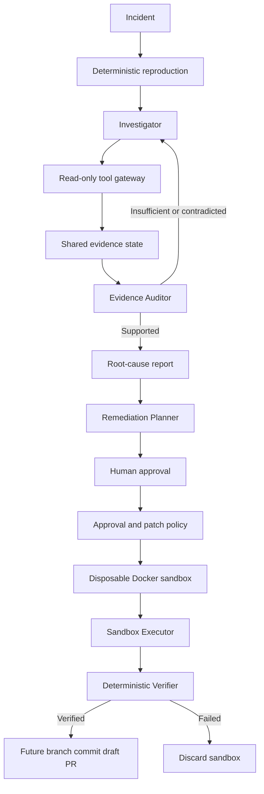

# TraceRoot

TraceRoot investigates software incidents, records evidence, and produces a root-cause report. It runs against a separate target repository and preserves the target Git history.

## What it does

1. Reproduces the reported failure.
2. Collects bounded runtime evidence.
3. Uses one read-only Investigator to select evidence tools.
4. Uses an independent Evidence Auditor to check root-cause claims.
5. Creates a proposal-only remediation plan only after ROOT_CAUSE_SUPPORTED.

The current agents are Investigator, Evidence Auditor, and Remediation Planner. The planner has no tools or write permissions.

## Architecture

## Safety boundaries

- Target source, logs, database inspection, configuration, Git, and tests are read-only during investigation.
- Benchmark ground-truth paths are blocked.
- LocalRunner is investigation-only.
- DockerRunner is required for future execution.
- Exact-diff human approvals bind patch hash, investigation, repository, sandbox session, expiry, and consumption state.
- Patch application is allowed only after exact human approval, deterministic patch-policy validation, Docker-side git apply --check, and Docker-only execution.

## Status

BUG-003 reached ROOT_CAUSE_SUPPORTED with an Auditor verdict of SUPPORTED.

BUG-006 has a deterministic Docker reproduction: the public regression test expected paid and observed pending. Its live graph run later ended as MODEL_DECISION_FAILURE after invalid Azure output, before the Auditor ran.

BUG-005 remains incomplete. Its Auditor identified missing runtime pool, stack-trace, and request-correlation evidence.

## Run

Prepare an isolated target environment:

    python -m traceroot prepare --repository TARGET_REPOSITORY --docker "$(command -v docker)"

Run an investigation using a sanitized target checkout and a local provider configuration:

    python -m traceroot investigate --session SESSION --task-file task.json --env-file .env

See [manual runs](docs/day-6-manual-runs.md) and [state and recovery](docs/investigation-state.md).

## Verification

The verifier must be deterministic because the planner must not judge its own proposal. When enabled, it returns FIX_VERIFIED only if the original reproduction passes and the regression suite passes. Other outcomes distinguish persistent reproduction failure, regressions, and execution failure.

Implementation logs and benchmark results are in [docs](docs/).

Latest application verification: 122 passed, 4 skipped.

Docker patch dry-run verification: 7 executor and dry-run tests passed.

Approved Docker patch application was exercised with a real human-approved BUG-001 patch. The approval was consumed, the original reproduction passed, and the regression suite passed.

Deterministic verifier statuses are implemented and tested: FIX_VERIFIED, REPRODUCTION_STILL_FAILS, REGRESSION_INTRODUCED, and VERIFICATION_TOOL_FAILURE.

Sandbox rollback restores the base session image; sandbox destruction removes session-owned containers, network, and images.

- BUG-001 end-to-end remediation completed: exact approval, Docker patch check, derived-image apply, reproduction 1/1 passing, regression 14/14 passing, and sandbox destruction.

## Approval interface

Run `python -m traceroot approval-ui --session SESSION --patch-file PATCH --investigation-id ID`. Open the displayed localhost URL, inspect the exact diff and SHA-256, then approve it. The UI is loopback-only and writes the same bound approval record used by the executor.

The full local dashboard lives in `ui/` and is served by `approval-ui` on localhost.

Approval UI runtime smoke test added after missing import fix.

The approval dashboard uses a loopback WebSocket for live backend-to-frontend approval events. APIs live under `traceroot/api/`.

Docker patch dry-run now streams the approved diff with interactive stdin.

The UI is an incident-response workspace, not a coding editor; it shows evidence, audit, remediation, and sandbox approval state.

## Latest live remediation result

BUG-001 completed in a disposable Docker session. The exact approved patch was applied to a derived image only. The original reproduction passed **1/1** and the regression suite passed **14/14**. The approval was consumed and the session containers, network, base image, and derived image were destroyed.

Latest benchmark result: BUG-003 exact approved remediation returned FIX_VERIFIED in Docker. The retry reproduction passed 1/1 and the regression suite passed 15/15; its disposable sandbox was destroyed.

Latest benchmark reproduction: BUG-004 failed 1/1 in Docker. Payment returned HTTP 500 where 201 is expected after the httpx upgrade. Its review-only candidate replaces obsolete httpx proxies with proxy and awaits exact approval.

## Repository hygiene

Generated sessions, caches, logs, local credentials, UI caches, and generated run documents are ignored. Required README and milestone documentation remain tracked.
