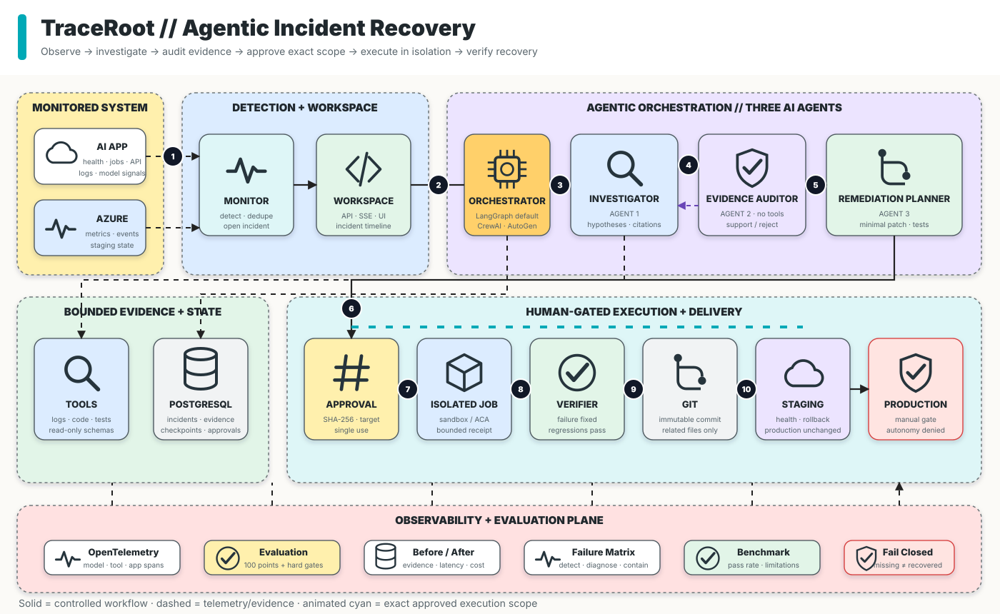
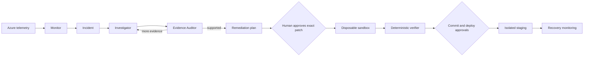

# TraceRoot

TraceRoot watches an AI application, opens an incident when it sees a meaningful failure, gathers evidence, checks its own diagnosis, and prepares a small fix for review.

It is built around a simple rule: investigation can be automatic, but changes are not. Reading logs, code, configuration, tests, and database metadata is allowed. Applying a patch, committing it, or deploying it requires an explicit approval tied to the exact change.

[](docs/images/traceroot-pipeline.svg)

> **Interactive view:** select the diagram to open it directly, then hover or
> focus a stage and follow its link to the implementation or evidence. Motion
> respects the operating system's reduced-motion preference.

TraceRoot has **three AI roles**—Investigator, Evidence Auditor, and Remediation
Planner. The other blocks are deterministic safety and delivery components.

## What works today

TraceRoot currently has three AI roles:

- **Investigator** collects bounded, read-only evidence and maintains hypotheses.
- **Evidence Auditor** reviews only the cited evidence and returns `SUPPORTED`, `INSUFFICIENT`, or `CONTRADICTED`.
- **Remediation Planner** proposes a focused change after the diagnosis is supported.

The sandbox executor, verifier, Git workflow, and staging deployer are deterministic components. They enforce policy and run commands; they are not additional agents.

The workspace can use LangGraph, CrewAI, or AutoGen as its orchestration layer. All three routes use the same tools, budgets, checkpoints, evidence rules, and approval gates. LangGraph is the default.

## A real incident we tested

TraceRoot monitors the deployed EduForge AI application on Azure. During a controlled job, EduForge completed all ten stages but reported `succeeded_partial` and emitted a low-confidence `grade_band` warning.

TraceRoot detected the degradation without a manual bug report, opened incident `b57b4ab4fc21`, correlated the job state with the model-quality warning, and sent the evidence to the Auditor. The Auditor returned `SUPPORTED`.

The approved remediation was tested in disposable Docker environments:

| Check | Before | After |
| --- | ---: | ---: |
| Grade-band classification cases | 0/3 | 3/3 |
| Focused classification tests | — | 49 passed |
| EduForge unit tests | — | 429 passed, 1 skipped |

These counts come from the committed [verification receipt](artifacts/incidents/b57b4ab4fc21/verification-v3.json). They describe one controlled incident, not a general recovery success rate.

The recovery branch is `traceroot/b57b4ab4fc21-grade-band-recovery` at commit `054a2ad`.

The later staging pipeline completed 10/10 stages and produced its package, but still ended as `succeeded_partial` because generic replay responses exercised degraded fallback paths. The classification defect is fixed in the measured cases; a clean end-to-end staging recovery has not yet been demonstrated.

## How the workflow is separated


```mermaid
flowchart LR
    A[Azure telemetry] --> B[Monitor]
    B --> C[Incident]
    C --> D[Investigator]
    D --> E[Evidence Auditor]
    E -->|more evidence| D
    E -->|supported| F[Remediation plan]
    F --> G{Human approves exact patch}
    G --> H[Disposable sandbox]
    H --> I[Deterministic verifier]
    I --> J{Commit and deploy approvals}
    J --> K[Isolated staging]
    K --> L[Recovery monitoring]
```

The model never receives a general-purpose production write tool. Approval records are bound to the patch digest and target. The verifier reruns the original reproduction and regression checks before a change can move forward.

## Run it locally

You need Python 3.12, Docker, and credentials for a configured model provider.

```bash
python3 -m pip install -r requirements.txt
python3 -m pytest -q
python3 -m traceroot workspace-ui --host 127.0.0.1 --port 8875
```

Open `http://127.0.0.1:8875/`.

To monitor EduForge:

```bash
python3 -m traceroot monitor \
  --name eduforge-ai \
  --url https://eduforge-ai.azurewebsites.net \
  --repository https://github.com/23f3001800/EduForge-AI \
  --workspace-dir .traceroot-workspace \
  --state-file .traceroot-monitor.json \
  --interval 30
```

The monitor container setup is in [deploy/monitor/README.md](deploy/monitor/README.md). The local UI runbook is in [docs/home-runbook.md](docs/home-runbook.md).

## Azure staging UI

The staging UI is deployed at [traceroot-staging-ui.azurewebsites.net](https://traceroot-staging-ui.azurewebsites.net/). Microsoft Entra authentication protects its API.

Browser requests are redirected to Microsoft sign-in. API clients receive 401 until they authenticate. The hosted workspace still uses files inside one container, so it is suitable for staging but is not durable multi-replica storage.

## Safety boundaries

- Investigation tools are read-only and schema constrained.
- Tool and model calls have time, count, and token budgets.
- Secrets and authorization headers are redacted from stored evidence.
- The Auditor has no tools.
- Patch execution requires approval of the exact SHA-256 digest.
- Execution happens in a disposable sandbox.
- Commit, publication, and staging deployment use separate approvals.
- Failed staging verification stops the staging target.
- Production promotion is not implemented.

## Repository map

| Path | Purpose |
| --- | --- |
| `traceroot/autonomous_monitor.py` | Telemetry polling, detection, deduplication, and audit handoff |
| `traceroot/agents/` | Investigator, Auditor, Planner, and deterministic recovery components |
| `traceroot/orchestrator/` | LangGraph, CrewAI, and AutoGen adapters |
| `traceroot/tools/` | Bounded evidence tools |
| `traceroot/runtime_connectors.py` | Credential references, origin restrictions, and redaction |
| `traceroot/workspace_ui.py` | Workspace HTTP API and event stream |
| `ui/workspace/` | Incident workspace frontend |
| `tests/` | Contract, monitoring, recovery, provider, and UI tests |

## What is still missing

- Durable shared storage for incidents, checkpoints, events, and approvals.
- An Azure job executor for approved sandbox remediation and verification.
- A clean `succeeded` staging quality run without replay fallback warnings.
- First-class distributed traces for model, RAG, and tool operations.
- Broader evaluation across several applications and failure types.

## Operational extensions

- `TRACEROOT_DATABASE_URL=postgresql://...` enables PostgreSQL-backed incident and event state; local files remain the development default.
- `OTEL_EXPORTER_OTLP_ENDPOINT=https://...` enables OTLP traces for monitor polls and workspace events.
- Approved staging remediation can run as an immutable Azure Container Apps Job through `traceroot.agents.azure_job_executor`.
- The controlled evaluation manifest and generated before/after evidence live under `evaluations/`; the compact result is in `docs/benchmark-report.md`.
- `.github/workflows/azure-staging.yml` verifies, deploys staging, probes health, rolls back failures, and uses the protected `production` environment for manual promotion approval.

The detailed engineering backlog is in [docs/limitations-roadmap.md](docs/limitations-roadmap.md).

Licensed under [LICENSE](LICENSE).

