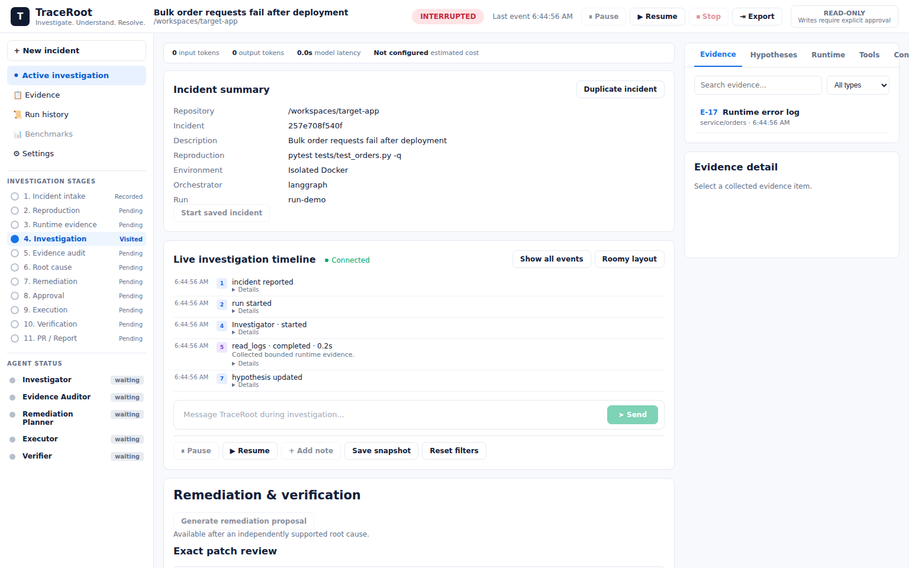
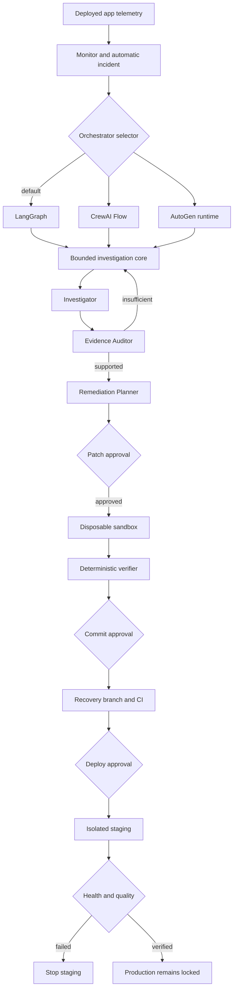

# TraceRoot

**Autonomous incident monitoring and recovery for deployed AI applications.**

TraceRoot detects failures from production telemetry, correlates evidence across application and AI components, independently audits the proposed root cause, and prepares bounded remediation. Investigation is read-only; source, runtime, and deployment changes require explicit human approval and deterministic verification.

[Homepage runbook](docs/home-runbook.md) | [Limitations roadmap](docs/limitations-roadmap.md) | [Project assessment](docs/project-assessment.md) | [Interview questions](docs/interview-questions.md)

The local operator UI is served at http://127.0.0.1:8875/ (root /).



## What it demonstrates

AI applications fail across application code, models, providers, prompts, retrieval, tools, infrastructure, and data. TraceRoot turns those disconnected signals into one evidence-backed workflow:

1. Monitor deployed health, jobs, metrics, logs, and traces.
2. Detect runtime, application, model, provider, RAG, and tool failures.
3. Open an incident automatically, without a manual bug report.
4. Correlate evidence into testable root-cause hypotheses.
5. Use an independent, tool-less Evidence Auditor to validate cited claims.
6. Propose the smallest bounded remediation.
7. Require exact human approval before any write.
8. Execute only in disposable Docker and verify actual recovery.
9. Commit and deploy only through separately approved deterministic components.
10. Verify an isolated staging slot before any production promotion.

## Live Azure integration

TraceRoot is connected read-only to the deployed **EduForge AI** application on Azure App Service. The connector collects health and readiness, job state and warnings, token usage and cost, measured application/model counters, and bounded Prometheus telemetry. It stores credential references rather than credential values, keeps a durable cursor, computes counter deltas, and suppresses duplicate incidents.

### Verified live result — 20 September 2026

A controlled authenticated job exercised the real Azure-backed EduForge pipeline:

| Result | Measured value |
| --- | ---: |
| Job ID | `446c7d47-1e03-41fa-a432-a47aea05557e` |
| Terminal state | `succeeded_partial` |
| Completed stages | 10/10 |
| Model attempts | 16 |
| Tokens consumed | 30,835 |
| Warning | `educational-classification: low confidence: grade_band` |
| HTTP 5xx in retained Azure sample | 0 |

This is a real model-quality degradation, not a fixture: the application completed only partially after reporting low-confidence classification. TraceRoot recognized the transition and warning as correlated application and model evidence, automatically opened incident `b57b4ab4fc21`, and invoked the independent Evidence Auditor once with a 1,024-token output cap, no thinking budget, and no retries.

The Auditor returned **SUPPORTED** with two citations: the application-level `succeeded_partial` observation and the model-level low-confidence classification warning.

The approval-bound remediation was then evaluated entirely in disposable Docker. Low-confidence grade-band resolution improved from **0/3 at baseline**, to **1/3 after the first approved patch**, to **3/3 after the final approved correction**. Deterministic verification returned `FIX_VERIFIED`: all **49 focused classification tests passed**, and the broader unit suite reported **429 passed, 1 skipped, 0 failed**.

The exact recovery line is committed through `054a2ad` on
`traceroot/b57b4ab4fc21-grade-band-recovery` and published to GitHub. No PR
was created and production was not changed. The persistent monitor is running
against Azure and currently reports a healthy deployment with no new signals.

### Staging recovery follow-up — 29 September 2026

The immutable replay artifact was deployed to the separate
`eduforge-ai-staging` Web App. The physics quality job completed **10/10 stages**
at **100%**, produced package `a04cca51-1c4d-4a06-aa71-55583e75b8dd`, and used
zero live-model tokens at zero model cost. The classification evaluation remains
**3/3**, compared with **0/3** at baseline, and the current EduForge unit suite
passes **433/433**.

The staging job's terminal state was `succeeded_partial`, not `succeeded`,
because generic replay outputs intentionally exercised degraded fallback paths
and emitted non-fatal warnings. TraceRoot therefore records the classification
recovery as verified but does **not** claim a clean end-to-end staging recovery.
Staging was stopped after verification; production remained unchanged.

## Architecture


```mermaid
flowchart TB
    A[Deployed app telemetry] --> B[Monitor and automatic incident]
    B --> S{Orchestrator selector}
    S -->|default| LG[LangGraph]
    S --> CR[CrewAI Flow]
    S --> AG[AutoGen runtime]
    LG --> C[Bounded investigation core]
    CR --> C
    AG --> C
    C --> IV[Investigator]
    IV --> D[Evidence Auditor]
    D -->|insufficient| C
    D -->|supported| E[Remediation Planner]
    E --> F{Patch approval}
    F -->|approved| G[Disposable sandbox]
    G --> H[Deterministic verifier]
    H --> I{Commit approval}
    I --> J[Recovery branch and CI]
    J --> K{Deploy approval}
    K --> L[Isolated staging]
    L --> M{Health and quality}
    M -->|failed| N[Stop staging]
    M -->|verified| O[Production remains locked]
```

Monitoring extends the existing incident state machine. The executor, verifier,
Git workflow, and staging deployer are deterministic enforcement components.
They do not add agents or bypass any approval boundary.

### Selectable orchestration

The workspace can start an incident with **LangGraph**, **CrewAI**, or
**AutoGen**. LangGraph is the native default. CrewAI wraps the bounded core in a
Flow; AutoGen routes a typed investigation message through a single-threaded
runtime. All three use the same read-only tools, durable checkpoints, Evidence
Auditor, approval records, cost/latency events, sandbox executor, and verifier.
An unavailable optional backend is disabled in the UI and rejected by the API;
TraceRoot never silently falls back to a different orchestrator.

These are three orchestration engines, not three additional AI agents.

### Component count

TraceRoot has **three AI decision roles**:

1. **Investigator** — selects bounded read-only evidence actions and maintains hypotheses.
2. **Evidence Auditor** — judges only supplied evidence and has no tools.
3. **Remediation Planner** — proposes a bounded change only after the root cause is supported.

The **Sandbox Executor**, **Verifier**, **Git workflow**, and **Staging
Deployer** are deterministic software components, not autonomous or model-driven
agents. Human approval is a security boundary, not an agent. TraceRoot uses
models for constrained judgment and ordinary code for enforcement.

## Safety boundaries

- Investigation tools are read-only and schema constrained.
- Runtime connectors use HTTPS origins, bounded reads, timeouts, and credential references.
- Secrets and authorization fields are redacted before evidence is stored.
- Private reasoning, prompts, and tool arguments are not published.
- The Evidence Auditor has no tools and cannot manufacture evidence.
- Remediation remains proposal-only until exact human approval.
- Approved changes run only in a disposable Docker environment.
- Recovery requires the original reproduction and regression suite to pass.
- Target commits and PR preparation require separately bound approvals.
- Deployment approval is bound to the verified commit, exact ZIP hash, CI
  result, Azure application, staging slot, and HTTPS verification endpoints.
- The deployer accepts only named non-production slots. Failed staging health
  verification stops that slot and leaves production unchanged.

## Run

Requirements: Python 3.12, Docker for sandbox execution, and one configured model provider.

```bash
python3 -m pip install -r requirements.txt
python3 -m pytest -q
```

Start autonomous read-only monitoring:

```bash
python3 -m traceroot monitor \
  --name eduforge-ai \
  --url https://eduforge-ai.azurewebsites.net \
  --repository https://github.com/23f3001800/EduForge-AI \
  --workspace-dir .traceroot-workspace \
  --state-file .traceroot-monitor.json \
  --interval 30
```

Add `--job-id JOB_UUID` to watch a deployed job. Other operator entry points:

For a hardened long-running container with a persistent cursor and automatic
process restart, use the [monitor Compose deployment](deploy/monitor/README.md).
The host remains responsible for starting the Docker daemon.

```bash
python3 -m traceroot prepare --repository TARGET_REPOSITORY --docker "$(command -v docker)"
python3 -m traceroot investigate --session SESSION --task-file task.json --env-file .env
python3 -m traceroot workspace-ui --host 127.0.0.1 --port 8875
python3 -m traceroot approval-ui --session SESSION --patch-file PATCH --investigation-id ID
```

Then open `http://127.0.0.1:8875/`. See the
[home-page runbook](docs/home-runbook.md) for monitoring, deployment, verification,
and shutdown instructions.

## Verification

- Monitor plus workspace/recovery integration: **32 tests passed** before watched-job support.
- Current TraceRoot regression run: **183 passed, 5 skipped**.
- Selectable orchestrator and workspace integration: **17 passed**.
- Real Docker remediation previously completed with exact approval, policy validation, passing reproduction and regression, approval consumption, and sandbox destruction.

Test totals are evidence from named runs, not invented status indicators.

## Repository map

| Path | Responsibility |
| --- | --- |
| `traceroot/autonomous_monitor.py` | Telemetry, detection, correlation, deduplication, audit handoff |
| `traceroot/orchestrator/` | Explicit LangGraph, CrewAI, and AutoGen selection over one bounded core |
| `traceroot/agents/` | Three AI roles plus deterministic approval, execution, and verification components |
| `traceroot/agents/staging_deployer.py` | Approval-bound Azure staging deployment and failure containment |
| `traceroot/runtime_connectors.py` | Credential-reference gateway and redaction |
| `traceroot/workspace_events.py` | Durable incident/event journal |
| `traceroot/tools/` | Bounded read-only evidence tools |
| `ui/workspace/` | Local incident operations console |
| `tests/` | Contract, recovery, sandbox, provider, workspace, and monitoring tests |
| `docs/` | Architecture decisions, policies, benchmarks, operator guides |

## Known limitations

- The recovery is verified, committed, and published on a bounded branch. The
  first approved slot deployment was rejected by Azure before deployment
  because the current Basic App Service plan permits no additional slots.
- Azure logs and distributed traces are not retained because the deployed app has no Log Analytics diagnostic routing.
- RAG and tool signals need first-class normalization when the application exports those spans.
- EduForge metrics currently reset on application restart.
- Staging failure containment stops the isolated slot; immutable artifact
  rollback history is not yet implemented.
- The isolated `eduforge-ai-staging` Web App completed every pipeline stage and
  produced a package, but deterministic replay fallback warnings yielded
  `succeeded_partial`; clean end-to-end staging recovery is not claimed.
- Production promotion is intentionally not implemented.

TraceRoot favors evidence over confident prose, explicit contracts over unrestricted tools, and recoverable execution over direct production mutation. Missing evidence produces `INSUFFICIENT`, not a plausible story.

Licensed under [LICENSE](LICENSE).
