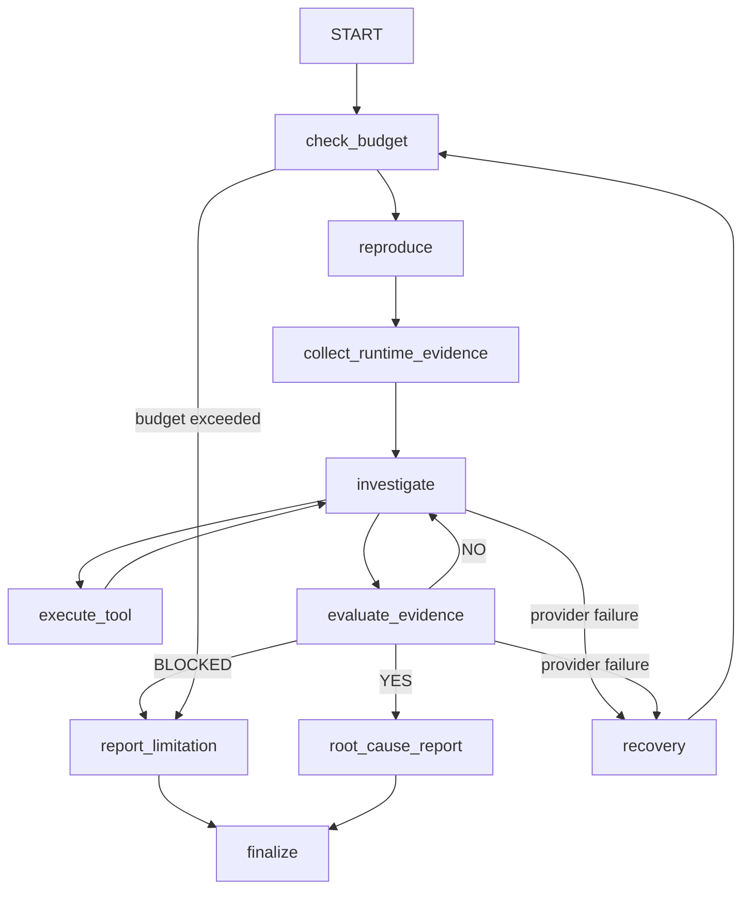

# Day 5: LangGraph orchestration

TraceRoot now uses LangGraph to orchestrate the existing single read-only
investigator. LangGraph does not add agents or change target-app permissions.
It decides which unit of work runs next from the persisted investigation state.



## Five terms

| Term | TraceRoot use |
|---|---|
| Node | A unit of work such as `reproduce` or `evaluate_evidence`. |
| Edge | A transition between nodes. |
| Conditional edge | A transition selected from `graph_next` in persisted state. |
| State | The existing Day 4 investigation checkpoint shared by every node. |
| Checkpoint | The atomic `state.json` saved after meaningful graph transitions. |

Agent reasoning and LangGraph routing are different. The investigator reasoning
node may choose `inspect_database`. LangGraph decides whether a tool result goes
back to investigation, evidence evaluation, recovery, limitation reporting, or
finalization.

## State and checkpoints

`InvestigationState` is a typed view of the existing version-2 `state.json`.
It contains the existing task, steps, hypotheses, transcript, provider failures,
budgets and final report, plus derived graph views:

- `incident`, `reproduction`, `observations`, `evidence`, `tool_history`
- `provider_errors`, `current_subsystem`, `status`, `step_count`, `model_calls`
- `graph_next`, `planned_action`, `provider_retry_count`, `evaluation`

There is no second investigation database or in-memory-only source of truth.
LangGraph state is written to the existing atomic checkpoint after reproduction,
runtime collection, hypothesis update, tool result, evidence evaluation, provider
recovery, limitation report, root-cause report, and finalization.

A resumed graph loads the checkpoint, keeps the original task and cumulative
budgets, and routes from `graph_next`. Successful reproduction and saved tool
results are never replayed. An interrupted tool action reports a limitation rather
than claiming exactly-once execution.

## Nodes

`reproduce`, `collect_runtime_evidence`, `check_budget`, `execute_tool`,
`recovery`, `report_limitation`, and `finalize` are deterministic. They do not
call the model.

`investigate` is the only tool-selection reasoning node. It updates hypotheses
and either selects one read-only tool or explicitly hands off to evaluation.

`evaluate_evidence` is a separate reasoning boundary. It cannot select a tool or
change hypotheses. It returns `YES`, `NO`, or `BLOCKED`. A `YES` report must
match an already supported hypothesis and cite independent, concrete evidence.

Provider failures use `recovery`: each failed model request is recorded separately
from application evidence, backed off 0.5 then 1.0 seconds, and retried within the
model and time budgets. Exhaustion produces a resumable `TOOL_FAILURE` checkpoint.

## Run or resume

```bash
.venv/bin/python -m traceroot investigate \
  --session "$SESSION" \
  --task-file docs/investigator-task.example.json \
  --env-file .env \
  --max-tool-calls 15 \
  --max-model-calls 30 \
  --max-seconds 900 \
  --model-timeout 90
```

```bash
.venv/bin/python -m traceroot resume \
  --session "$SESSION" \
  --run-id "$RUN_ID" \
  --env-file .env
```

`resume` always uses the original persisted budgets. It cannot reset a run with
new command-line limits.

## ReAct comparison

| Metric | Day 3/4 ReAct loop | Day 5 LangGraph |
|---|---|---|
| Root cause found | Validated by state-machine recovery tests; live Gemini was intermittently unavailable | Validated through the graph test trajectory; live run uses the same six tools |
| Tool calls | Counter in linear loop | Counter in shared state, gated by `check_budget` |
| Model calls | Loop turns | Explicit `model_calls`, also gated by `check_budget` |
| Recovery success | Resume continued a linear loop | Recovery node routes to the interrupted reasoning boundary |
| Reproduction repeated | Guarded in loop | Deterministic `reproduce` node is idempotent |
| State lost after failure | Atomic Day 4 checkpoint | Same checkpoint after graph transitions |
| Final evidence quality | Final validator | Separate evaluator plus the same final validator |

LangGraph improves control, visibility and recovery. It does not guarantee better
model reasoning or provider availability.
